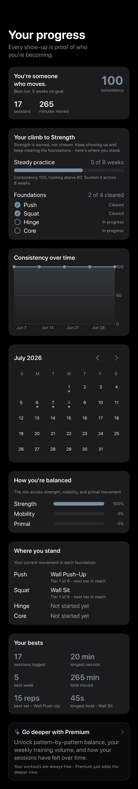

# US-SP04 - Phase-progress surface (the visible climb)

The free, read-only surface that shows a Discipline-Phase user how close they are to earning the Strength Phase, from real logs, using the exact same logic `PhaseEvaluator` gates on.

## Where it lives

The Progress tab (`Views/Progress/ProgressTabView.swift`), a new `PhaseProgressCard` shown just under the consistency headline - free, never premium-gated - and only while the user is still climbing (`phase == .discipline`).
Once the phase is earned, US-SP06's graduation moment and the strength surfaces take over.

## One source of truth (no re-derivation)

`PhaseEvaluator.evaluate(...)` is refactored to be *literally* `PhaseEvaluator.progress(...).hasEarnedStrength`, and the surface renders that same `PhaseProgress` value.
The number the card shows and the decision the gate makes are one computation, so they cannot drift.
`PhaseProgress` exposes the component signals the gate is built from:

- **Consistency** - `weeksSustained` of `requiredWeeks` (the active-week span toward the ~8-week window), plus `currentScore` vs `scoreThreshold` (the 80+ bar the recency-weighted Consistency Score must hold).
- **Competence** - `foundations`, one `(pattern, isCleared)` per push/squat/hinge/core in evaluator order, each `isCleared` being the exact entry-tier `AdvancementCriteria` test the gate uses.

## Validation Test (PRD)

- **Setup:** a synthetic user with 5 sustained weeks and push + squat cleared (hinge/core not).
- **Expected:** shows "5 of 8 weeks" and exactly 2 of 4 foundations cleared, matching what `PhaseEvaluator` would gate on; the user is *not* shown as earned.

Proven three ways:

- `PhaseEvaluatorTests.testProgressReportsFiveOfEightWeeksAndTwoOfFourFoundations` - the pure component values and the gate agree (`hasEarnedStrength == false`, `evaluate == .discipline`).
- `PhaseEvaluatorTests.testProgressEarnedFlagMatchesGateAcrossScenarios` - `progress.hasEarnedStrength == (evaluate == .strength)` across every phase scenario, so the surface can never disagree with the gate.
- `ProgressViewModelTests.testLoadPopulatesPhaseProgressMatchingTheGate` - the view model loads the same numbers over the real catalog and agrees with `PhaseEvaluatorService.phase`.

## Rendered evidence

`PhaseProgressEvidenceTests.testPhaseProgressCardShowsFiveOfEightAndTwoOfFour` hosts the production `ProgressTabView` over the exact validation history and asserts the live accessibility tree carries "5 of 8 weeks", "2 of 4 cleared", "Push, cleared", "Squat, cleared", "Hinge, in progress", and "Core, in progress", then captures the screen.

The card reads: **Your climb to Strength** - "Steady practice 5 of 8 weeks" with "Consistency 100, holding above 80", and **Foundations 2 of 4 cleared** with Push/Squat checked (Cleared) and Hinge/Core open (In progress).
Copy is identity-framed ("Strength is earned, not chosen"), never loss-framed; no XP, level, or streak.

Regenerate the PNG with `REPTODAY_WRITE_EVIDENCE=1` on the `RepToday` scheme (keep the filename).
